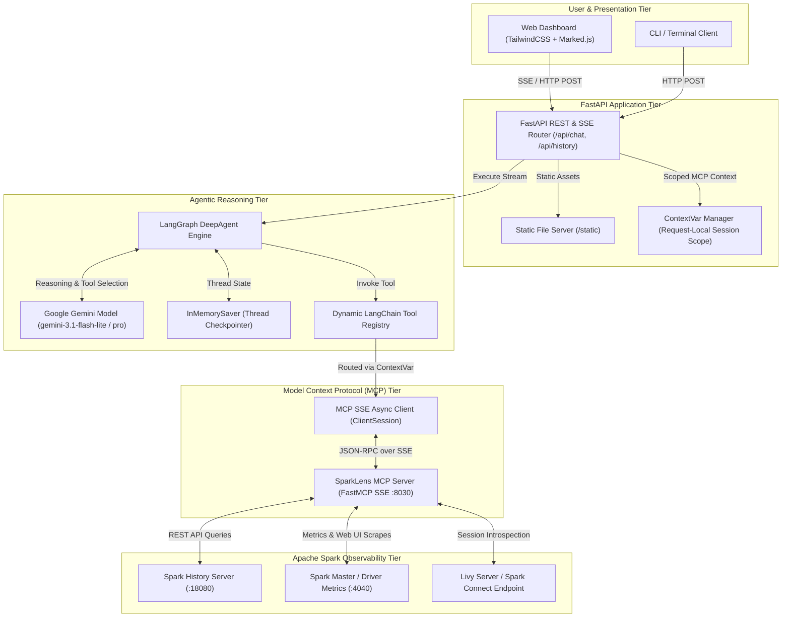
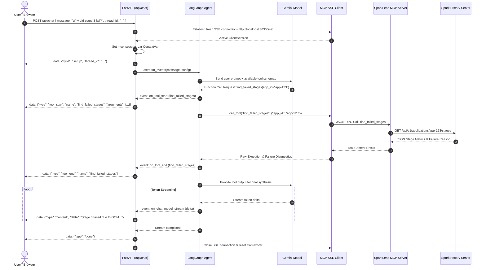
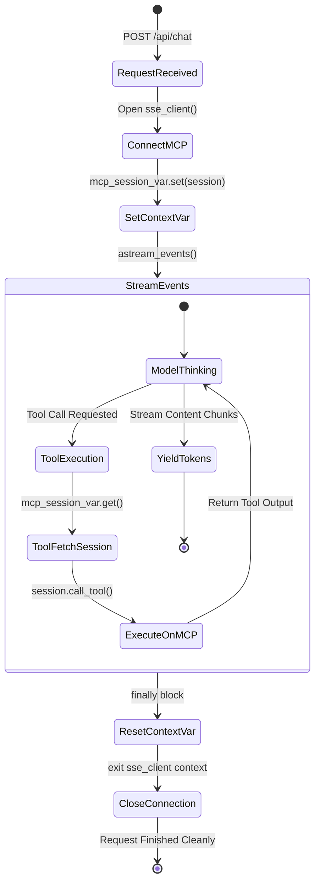

# SparkLens AI Agent - Architecture Overview

This document outlines the end-to-end system architecture of the **SparkLens AI Agent**, explaining how client interfaces, agentic reasoning models, dynamic tool bridges, and Apache Spark diagnostic clusters interact.

---

## 1. High-Level System Architecture

The SparkLens AI Agent is designed as a decoupled, multi-tiered AI diagnostic application. It bridges LLM reasoning with live Apache Spark execution data via the Model Context Protocol (MCP).

---

## 2. End-to-End Request & Streaming Sequence

When a user submits a question or diagnostic command, the backend establishes a request-local MCP connection, streams thoughts and tool invocations to the UI, and cleans up sockets upon completion.

---

## 3. Dynamic Tool Compilation Pipeline

The agent does not hardcode any MCP tool wrappers. Instead, tools are inspected, converted into Pydantic models at runtime, and registered into LangChain:

```mermaid
flowchart LR
    A["SparkLens MCP Server"] -->|"session.list_tools()"| B["Tool Definitions (JSON Schema)"]
    B -->|"json_schema_to_pydantic_model()"| C["Dynamic Pydantic Input Models"]
    C -->|"StructuredTool.from_function()"| D["LangChain StructuredTools"]
    D -->|"ContextVar Bridge"| E["Thread-Safe Tool Invocation"]
    E -->|"create_deep_agent()"| F["Compiled LangGraph Executable Graph"]
```

---

## 4. Connection Concurrency & ContextVar Lifecycle

To prevent HTTP/SSE keep-alive timeouts (`ClosedResourceError` or `RemoteProtocolError`), each concurrent request lifecycle is strictly isolated:

---

## 5. Technology Stack Summary

| Layer | Component | Description |
| :--- | :--- | :--- |
| **Frontend** | HTML5, Tailwind CSS, Marked.js | Lightweight responsive web UI with real-time SSE parsing |
| **API Server** | FastAPI, Uvicorn, Starlette | Asynchronous web framework serving REST and SSE endpoints |
| **AI / Agent Engine**| LangChain, LangGraph, DeepAgents | Agent workflow orchestration, memory checkpointing, and tool loop |
| **LLM Provider** | Google GenAI (`gemini-3.1-flash-lite`) | High-throughput, low-latency reasoning and diagnostic synthesis |
| **Tool Protocol** | Model Context Protocol (MCP), FastMCP | Standardized AI-to-tool client-server SSE communication |
| **Target Engine** | Apache Spark 3.x / 4.x | Spark History Server, Spark Connect, and driver metrics |
