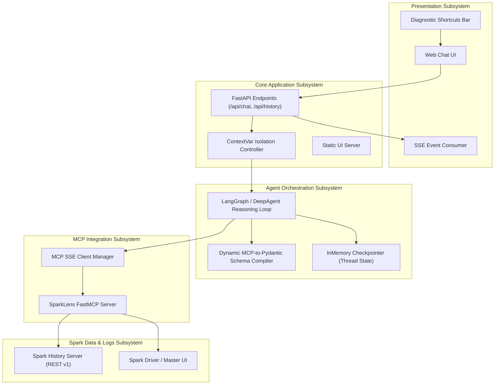
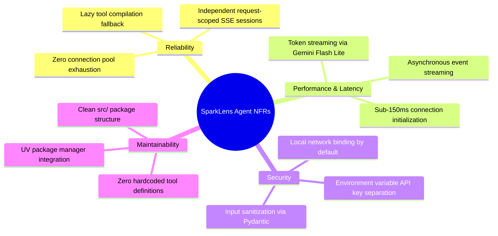

# SparkLens AI Agent - High Level Design (HLD)

This document specifies the High-Level Design (HLD) of the **SparkLens AI Agent**, covering system boundaries, functional requirements, architectural decisions, and failure modes.

---

## 1. System Context & Objectives

The primary objective of the SparkLens AI Agent is to provide an interactive, natural-language diagnostic platform for developers, data engineers, and DevOps personnel working with Apache Spark.

### Core Goals:
1. **Interactive Observability:** Eliminate manual browsing of raw Spark History Server logs and complex stage DAG metrics.
2. **Autonomous Problem Detection:** Detect data skew, task stragglers, out-of-memory (OOM) errors, WholeStageCodegen issues, and misconfigurations.
3. **Protocol Standardization:** Use the Model Context Protocol (MCP) to decouple LLM orchestration from low-level Spark APIs.
4. **Streaming Experience:** Provide real-time token streaming along with real-time visual progress indicators for tool execution.

---

## 2. Functional Architecture & Subsystems



---

## 3. Subsystem Breakdown

### 3.1 Presentation Subsystem (`/static/index.html`)
- **Responsive Dark Theme UI:** Built with Tailwind CSS and Marked.js.
- **SSE Chunk Parser:** Handles incoming Server-Sent Events line by line, parsing JSON payloads (`setup`, `tool_start`, `tool_end`, `content`, `done`, `error`).
- **Live Tool Execution Pills:** Displays spinning indicators with arguments during tool execution and transitions to checkmarks upon completion.
- **Session Switcher:** Generates new thread IDs (`uuid7`) to maintain separate conversation contexts.

### 3.2 Application & Routing Subsystem (`main.py`)
- **Endpoints:**
  - `POST /api/chat`: Primary SSE streaming endpoint accepting `ChatRequest` and yielding event streams.
  - `GET /api/new_thread`: Produces a UUIDv7 thread identifier.
  - `GET /api/history/{thread_id}`: Retrieves state snapshots from memory checkpointer.
  - `GET /`: Serves the web dashboard.
- **Resilient Startup (`lifespan`):** Attempts tool compilation on boot; falls back to on-demand compilation on first request if the MCP server is temporarily unavailable.

### 3.3 Agent Orchestration Subsystem (`langgraph` / `deepagents`)
- **System Prompt & Role:** Configured as a Senior Apache Spark Performance Tuning and Diagnostic Engineer.
- **Dynamic Tool Registry:** Converts MCP tool definitions to LangChain `StructuredTool` objects at startup.
- **State Checkpointing:** Stores user-agent interaction histories using `InMemorySaver`.

### 3.4 MCP Integration Subsystem (`mcp.client.sse`)
- **Transport:** SSE over HTTP (`/sse` endpoint).
- **Request Isolation:** Python `contextvars` store the active `ClientSession` per request task, ensuring concurrency safety and immediate socket cleanup upon response completion.

---

## 4. API Specifications & Data Contracts

### 4.1 Chat Streaming Endpoint (`POST /api/chat`)

**Request Payload:**
```json
{
  "message": "Check execution details for SQL query 21 in app-20260824161918-0000",
  "thread_id": "01a05e4e-a78a-7313-9bd9-a0a29376a8ca"
}
```

**SSE Stream Protocol Events:**
| Event Type | Payload Schema | Description |
| :--- | :--- | :--- |
| `setup` | `{"type": "setup", "thread_id": "..."}` | Emitted immediately to synchronize session thread ID |
| `tool_start`| `{"type": "tool_start", "name": "...", "arguments": {...}}` | Emitted when agent begins executing an MCP tool |
| `tool_end` | `{"type": "tool_end", "name": "..."}` | Emitted when MCP tool call successfully resolves |
| `content` | `{"type": "content", "delta": "..."}` | Emitted for each incremental LLM text token chunk |
| `done` | `{"type": "done"}` | Emitted when turn is finished |
| `error` | `{"type": "error", "message": "..."}` | Emitted if an unhandled exception occurs |

---

## 5. Non-Functional Requirements (NFRs)



---

## 6. Failure Modes & Mitigations

| Failure Scenario | Impact | Mitigation Strategy |
| :--- | :--- | :--- |
| **SparkLens MCP Server is down on boot** | Startup crash | `lifespan` catches error, logs warning, and retries lazily on the first `/api/chat` request. |
| **MCP SSE Server drops connection due to idle timeout** | Tool call failure with `ClosedResourceError` | Request-local session model: each request opens and closes its own fresh connection. |
| **Gemini API free tier rate limit exceeded** | API 429 quota exhaustion | Model fallback configured to high-capacity `google_genai:gemini-3.1-flash-lite`. |
| **Malformed Tool Output from Spark History Server** | Agent parse error | Dynamic Pydantic schema validation with schema error recovery. |
