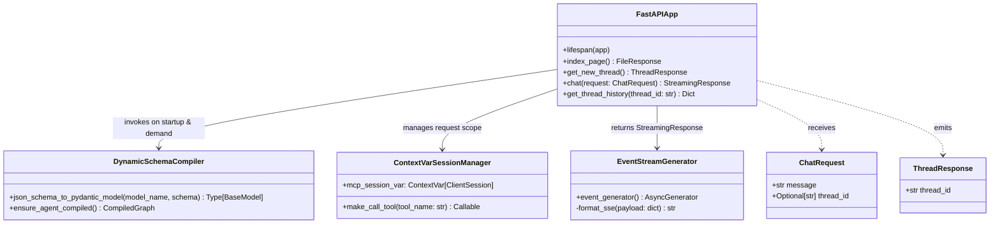
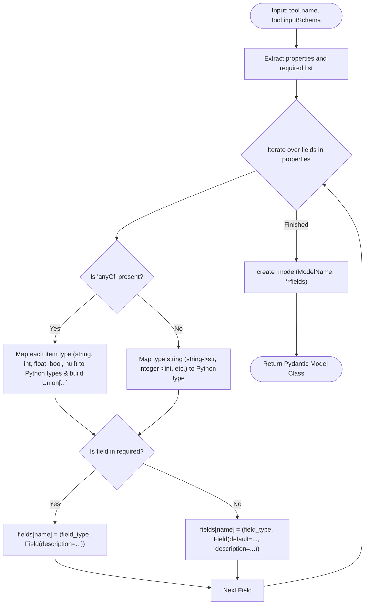
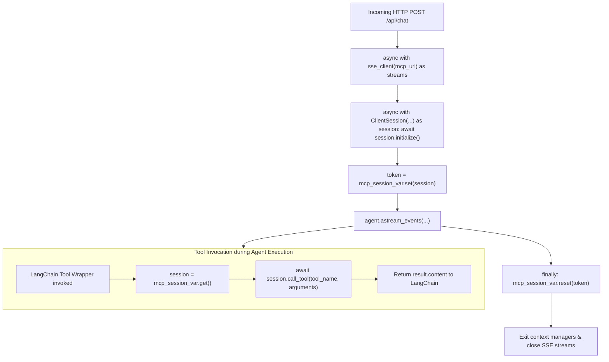
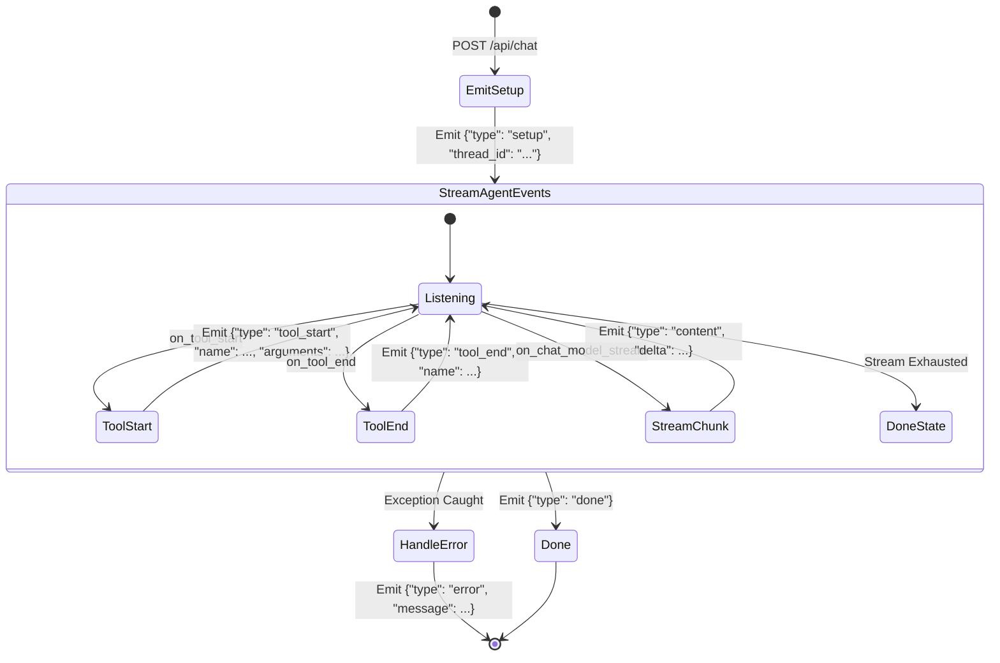
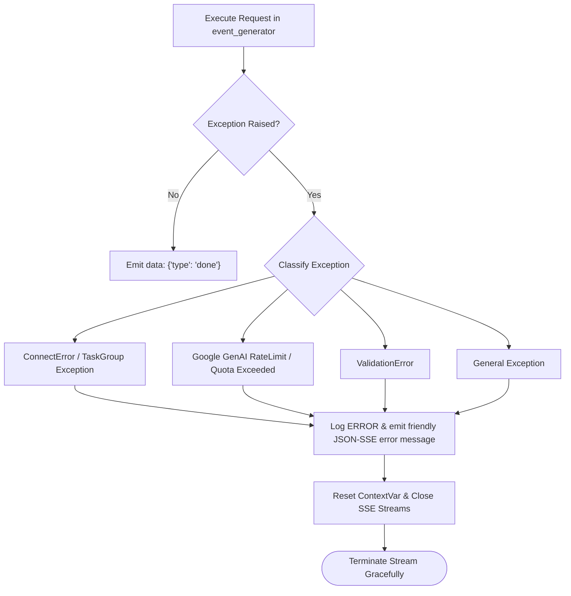

# SparkLens AI Agent - Low Level Design (LLD)

This document provides a detailed, code-level design of the **SparkLens AI Agent**, covering module architectures, class definitions, algorithms, data structures, and state management.

---

## 1. Class & Module Architecture



---

## 2. Dynamic Schema Compiler Algorithm

The `json_schema_to_pydantic_model` function dynamically translates JSON Schema definitions emitted by the FastMCP server into typed Pydantic models required by LangChain's `StructuredTool.from_function`.



### Key Python Implementation:
```python
def json_schema_to_pydantic_model(model_name: str, schema: Dict[str, Any]) -> Type[BaseModel]:
    fields = {}
    properties = schema.get("properties", {})
    required = schema.get("required", [])
    
    for field_name, field_info in properties.items():
        field_type: Any = Any
        type_str = field_info.get("type")
        
        if "anyOf" in field_info:
            types = []
            for t in field_info["anyOf"]:
                t_str = t.get("type")
                if t_str == "string": types.append(str)
                elif t_str == "integer": types.append(int)
                elif t_str == "number": types.append(float)
                elif t_str == "boolean": types.append(bool)
                elif t_str == "null": types.append(type(None))
            field_type = Union[tuple(types)] if len(types) > 1 else (types[0] if types else Any)
        else:
            if type_str == "string": field_type = str
            elif type_str == "integer": field_type = int
            elif type_str == "number": field_type = float
            elif type_str == "boolean": field_type = bool
            elif type_str == "array": field_type = list
            elif type_str == "object": field_type = dict
                
        description = field_info.get("description", "")
        default = field_info.get("default", None)
        
        if field_name in required:
            fields[field_name] = (field_type, Field(description=description))
        else:
            fields[field_name] = (field_type, Field(default=default, description=description))
            
    return create_model(model_name, **fields)
```

---

## 3. Request-Local Session Isolation via `ContextVar`

To prevent cross-request contamination and idle timeout disconnects on persistent SSE connections:



---

## 4. Streaming SSE Event Generator State Machine



---

## 5. Error Handling & Exception Management


