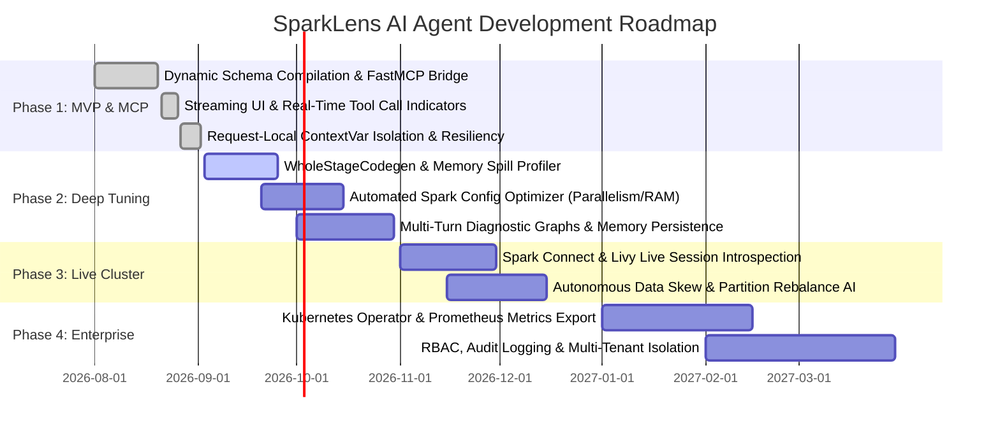

# SparkLens AI Agent - Project Roadmap 🗺️

This document outlines the strategic vision, milestones, and development roadmap for the **SparkLens AI Agent**.

---

## 1. Visual Roadmap & Milestones

---

## 2. Detailed Phase Breakdown

### ✅ Phase 1: MVP & Dynamic MCP Diagnostics (Completed)
- [x] Establish dynamic FastMCP SSE connection protocol.
- [x] Dynamic tool schema translation from JSON Schema to Pydantic models.
- [x] Real-time token streaming with live tool-calling execution pills in UI.
- [x] Request-local MCP session lifecycle management using Python `contextvars`.
- [x] Standalone package structure with UV and Hatchling.
- [x] Resilient startup with lazy on-demand MCP compiler fallback.

---

### 🚧 Phase 2: Deep Diagnostics & Configuration Tuning (In Progress)
- [ ] **Automated WholeStageCodegen Analysis:** Breakdown sub-operator execution times in SQL queries (Filter, HashAggregate, BroadcastExchange).
- [ ] **Config Optimization Advisor:** Recommend exact `spark.sql.shuffle.partitions`, `spark.executor.memory`, and `spark.default.parallelism` values based on observed task spills and stage runtime percentiles.
- [ ] **Persistent Memory Checkpointing:** Support Redis / PostgreSQL checkpointers for persisting diagnostic session histories across restarts.
- [ ] **Log Parsing & Exception Stack Traces:** Direct log file extraction for executor JVM crashes and GC pause spikes.

---

### 🔮 Phase 3: Live Spark Cluster Integrations (Planned)
- [ ] **Spark Connect Integration:** Direct connectivity with Spark 3.4+ and Spark 4.x Connect endpoints for live DataFrame introspection.
- [ ] **Livy Session Controller:** Trigger interactive diagnostic statements and explain plans on active Livy sessions.
- [ ] **Autonomous Skew Mitigation:** Generate ready-to-run PySpark and Spark SQL code patches (e.g. `salting` or `broadcast` join hints) to remediate detected data skew.

---

### 🏢 Phase 4: Enterprise & Production Readiness (Future)
- [ ] **Kubernetes & Cloud Support:** Integration with the Spark-on-K8s Operator, Amazon EMR, and Databricks.
- [ ] **Prometheus Metrics Exporter:** Export diagnostic activity and token usage metrics to Prometheus / Grafana.
- [ ] **Role-Based Access Control (RBAC):** Authenticate queries and restrict access to sensitive environment parameters.
- [ ] **Multi-Model Support:** Configurable fallback between Google Gemini, Anthropic Claude, and local Ollama models.

---

## 3. Feedback & Contributions

Contributions and ideas are welcome! Please open an issue or pull request in the repository to propose new features or diagnostic tools.
